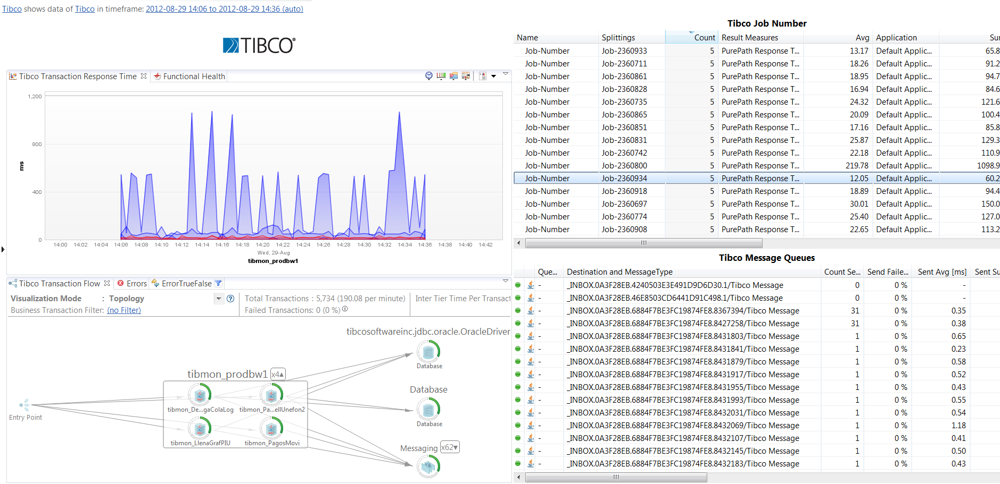
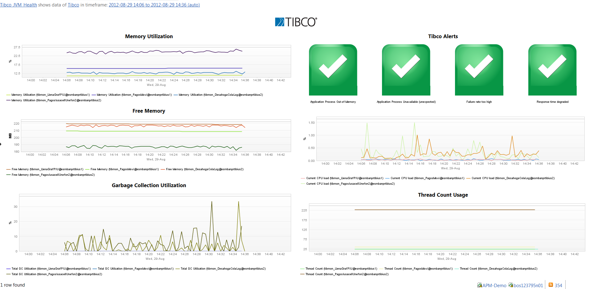

# Tibco FastPack

## Overview

The dynaTrace FastPack for Tibco enables deep insight into Tibco Business Works Server and the enclosing platform. This FastPack provides essential metrics which are visualized on different dashboards
including Tibco Business Transactions such as Job Number.

## Fast Pack Details

| Name | Tibco FastPack
| :--- | :---
| Author | Dan Breslin ([dan.breslin@compuware.com](mailto:dan.breslin@compuware.com))
| Supported dynaTrace Versions | >= 5.5
| Supported Tibco Versions | Tested with Tibco BW 5.4 and 5.7
| License | [dynaTrace BSD](attachments_5275722_2_dynaTraceBSD.txt)
| Support | [Community Supported](https://community.compuwareapm.com/community/display/DL/Support+Levels#SupportLevels-Community+Supported)  
| Release History | August 2013 Initial Release
| FastPack Contents |
| |1 System Profile  
| |1 Plugin  
| |2 Dashboards
| Download | [Tibco.dtp](Tibco.dtp)

## Content

The following components are part of this FastPack:

### Tibco System Profile

The reference Tibco System Profile contains a set of basic metrics required by the Dashboards of this FastPack for Tibco Business Works.

### Tibco Dashboard

The Tibco Dashboard gives insight into the Tibco Performance and Buisiness Transaction volume and response times.

### Tibco JVM Health Dashboard

The Tibco JVM Health Dashboard gives insight into health and performance of the Tibco Java Virtual Machne

